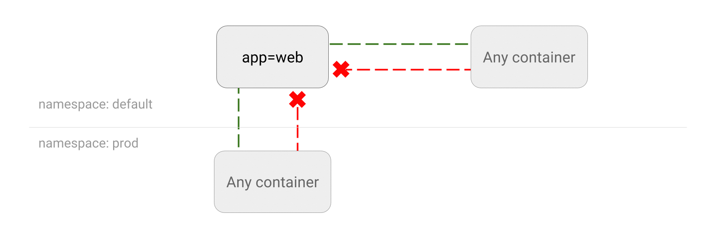

# What is a Kubernetes Network Policy?
A network policy is a specification of how groups of pods are allowed to communicate with each other and other network endpoints.NetworkPolicy resources use labels to select pods and define rules which specify what traffic is allowed to the selected pods.
To apply a NetworkPolicy definition in a Kubernetes cluster, the network plugin must support NetworkPolicy. Otherwise, any rules that you apply are useless. Examples of network plugins that support NetworkPolicy include Calico, Cilium, Kube-router, Romana, and Weave Net.




Do you need a NetworkPolicy resource defined in your cluster? The default Kubernetes policy allows pods to receive traffic from anywhere (these are referred to as non-isolated pods). So unless you are in a development environment, you’ll certainly need a NetworkPolicy in place.

## Enable network policy in minikube
By default minikube doesn't support network policies. You need to enable it using [calcio CNI](https://minikube.sigs.k8s.io/docs/handbook/network_policy/#kubernetes-network-policy-example) 
```
minikube start --cni calico
```


## Restrict communication

Crate namespace `space1` and pod named `app1` inside `space1` namespace, use `nginx:1.21.5-alpine` 

Create namespace `space2` and pod named `app2` inside `space2` namespace, use `nginx:1.21.5-alpine` image

We need a new NetworkPolicy named np that restricts all Pods in Namespace space1 to only have outgoing traffic to Pods in Namespace space2 . Incoming traffic not affected.

The NetworkPolicy should still allow outgoing DNS traffic on port 53 TCP and UDP.

```
# these should work
k -n space1 exec app1 -- curl -m 1 app2.space2.svc.cluster.local
k -n space1 exec app1 -- nslookup killercoda.com

# these should not work
k -n space1 exec app1 -- curl -m 1 killercoda.com
```